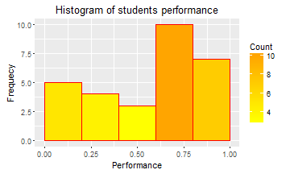

## Data Description. Part 1

- The data were taken from the programming course 1, which is being conducted in the first year of the careers of engineering faculty.  

- The dataset describes the grades until April 2016 in the activities evaluated.

- So far have been assessed **65** points

- Performance of each student is calculated by adding the cumulative score of each activity with respect to the points assessed to date and is expressed as a percentage.

- The average performance of the group is **56.97%**


--- .class #ddesc1 

## Data Description. Part 2

- The group is composed of **29** students from **12** university careers:  

**_Students Distribution by Career_**

```
## 
##       BIOINFORMATICS             CHEMICAL                CIVIL 
##                    1                    3                    2 
##  COMPUTER'S SCIENCES          ELECTRONICS     FOOD ENGINEERING 
##                    3                    3                    5 
##           INDUSTRIAL  MANAGEMENT SCIENCES          MECATRONICS 
##                    3                    1                    5 
##            MECHANICS MECHANICS INDUSTRIAL              PHYSICS 
##                    1                    1                    1
```


--- .class #ddesc2

## Exploratory Analysis. Part 1

- Students in this group have performance problems, as shown in the following chart:  

- The tendency is to lower ratings.   
           

--- .class #expAn1 

## Exploratory Analysis. Part 2


- As shown in the chart below, only **34.5%** of the group has performance above 70%.  


- Students of electronics and bioinformatics have better performance.


